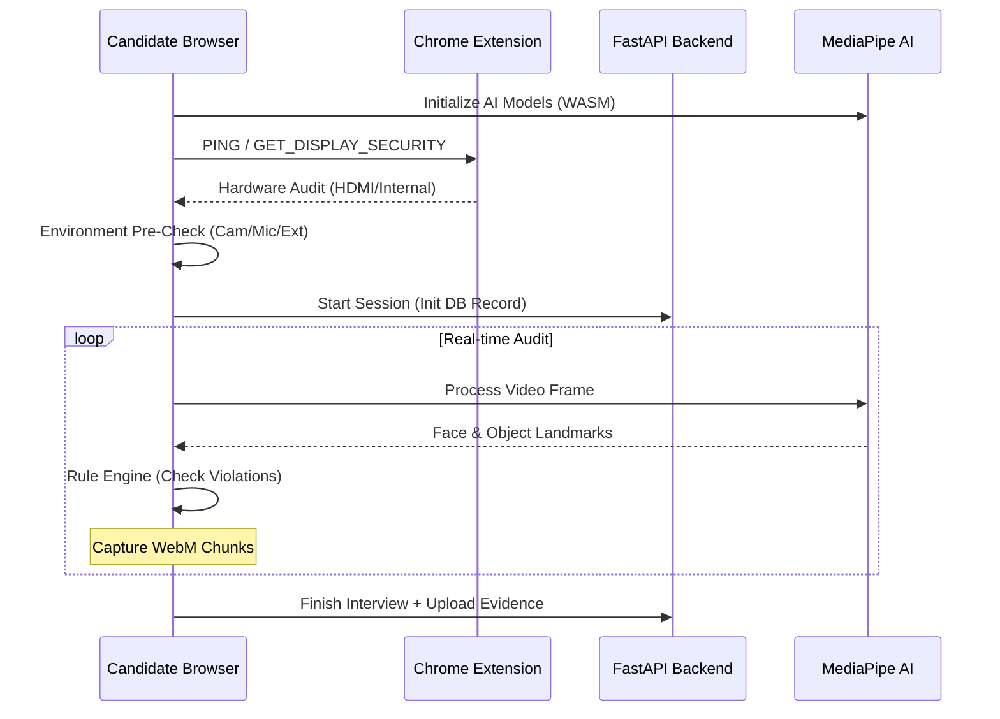
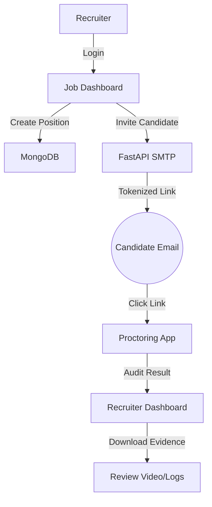

# Technical Report: HyrAI Proctoring System

## 1. Executive Summary
The HyrAI Proctoring System is a premium, AI-driven interview monitoring solution designed to ensure technical and behavioral integrity in remote assessments. It utilizes real-time neural auditing, hardware-level display detection, and automated communication workflows to provide recruiters with a high-fidelity audit trail of candidate behavior.

---

## 2. System Architecture & Tech Stack

The architecture is split into three primary layers: **Intelligence (AI)**, **Monitoring (Extension)**, and **Management (Backend)**.

### Core Technology Stack
| Layer | Technology | Key Libraries/Tools |
| :--- | :--- | :--- |
| **Frontend** | React 18, Vite | Tailwind CSS, Lucide Icons |
| **Intelligence** | MediaPipe WASM | `@mediapipe/tasks-vision` |
| **Monitoring** | Manifest V3 Extension | `chrome.system.display` |
| **Backend** | FastAPI (Python) | `uvicorn`, `motor` (Async MongoDB) |
| **Database** | MongoDB | `hyrai_db` |
| **Security** | JWT / OAuth2 | `python-jose`, `passlib` |
| **Real-time** | WebRTC | `MediaRecorder API` |

---

## 3. Feature Breakdown & Implementation

### A. Neural Audit Engine (AI)
The system uses computer vision to detect physical cheating attempts.
- **Face & Head Tracking**: Analyzes 468 3D landmarks to identify head-turning or absence.
  - *Library*: `MediaPipe FaceLandmarker`.
- **Eye-Iris Tracking**: Detects iris deviation (looking left/right at external resources) without needing specialized hardware.
  - *Library*: `MediaPipe FaceBlendshapes` (EyeLookOut/In scores).
- **Object Detection**: Identifies "cell phones" or additional "person" bodies in the frame.
  - *Library*: `MediaPipe ObjectDetector` (EfficientDet Lite0).

### B. Display & Peripheral Security
- **Multi-Monitor Blocking**: Prevents candidates from using secondary screens.
  - *Methods*: `Browser Window Management API` (Logical) + `HyrAI Extension` (Physical).
- **Mirroring/Duplicate Detection**: Detects if the screen is being shared via HDMI/DisplayPort to a hidden device.
  - *Method*: `chrome.system.display.getInfo`.
- **Focus Tracking**: Alerts if the candidate switches tabs or minimizes the browser.

### C. Automated Documentation
- **Evidence Capture**: Records a high-quality WebM video of the entire session.
- **Violation Logging**: Timestamps each suspicious event (e.g., "Phone Detected at 02:15").

---

## 4. System Flow Charts

### Candidate Onboarding & Live Session

### Recruitment Management Flow

---

## 5. HyrAI Security Guard (Extension)

### Why an Extension?
Standard browsers (Chrome/Edge) restrict access to physical hardware info for privacy. However, for high-stakes proctoring, we must know if an HDMI cable is splitting the signal to a "Duplicate" display.
- **Chrome API**: `chrome.system.display` provides unique `id`, `name` (e.g., "DELL U2412M"), and `isInternal`.
- **Reliability**: It detects monitors even if the candidate uses "Mirror Mode," which built-in JavaScript `window.screen` cannot see.

### Adding to Candidate's Laptop
1. **Direct Link**: The system automatically detects if the extension is missing and prompts the candidate with a download link.
2. **Developer Mode (Internal Testing)**:
   - Go to `chrome://extensions`.
   - Enable **Developer Mode**.
   - Click **Load Unpacked** and select the `/extension` folder.
3. **Web Store (Production)**:
   - Host the extension on the Chrome Web Store (Public or Private Unlisted).
   - Use the Web Store link in the application.

---

## 6. Integration Guide

To integrate this system into a main platform:

1. **API Handshake**:
   - The main platform should call the `/api/interviews/admin/interviews/create` endpoint to generate a session link.
   - **Schema**: `{ "candidate_name": "...", "job_id": "..." }`.

2. **Frontend Redirection**:
   - Redirect candidates to `[Proctoring_URL]/session?session_id=[ID]&name=[NAME]`.

3. **Webhook/Callback (Optional)**:
   - Once the interview is finished, the backend stores the `video_path` and `logs`. The main platform can query the repository for the candidate's audit score.

4. **Security Context**:
   - Both platforms should share a `SECRET_KEY` if JWT verification is strictly required across domains.

---

## 7. Compliance & Privacy
- **Consent**: Candidates must explicitly provide camera/mic permissions.
- **Local Processing**: AI inference happens locally in the candidate's browser (WASM); only logs and the final video are sent to the server.
- **Encryption**: Videos are stored securely on the backend server.
